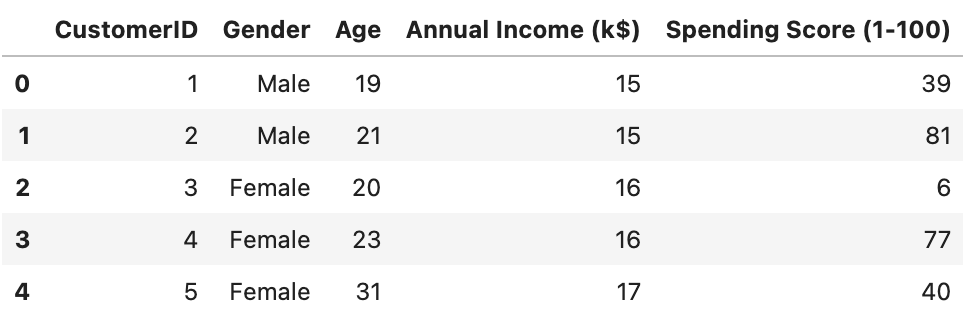
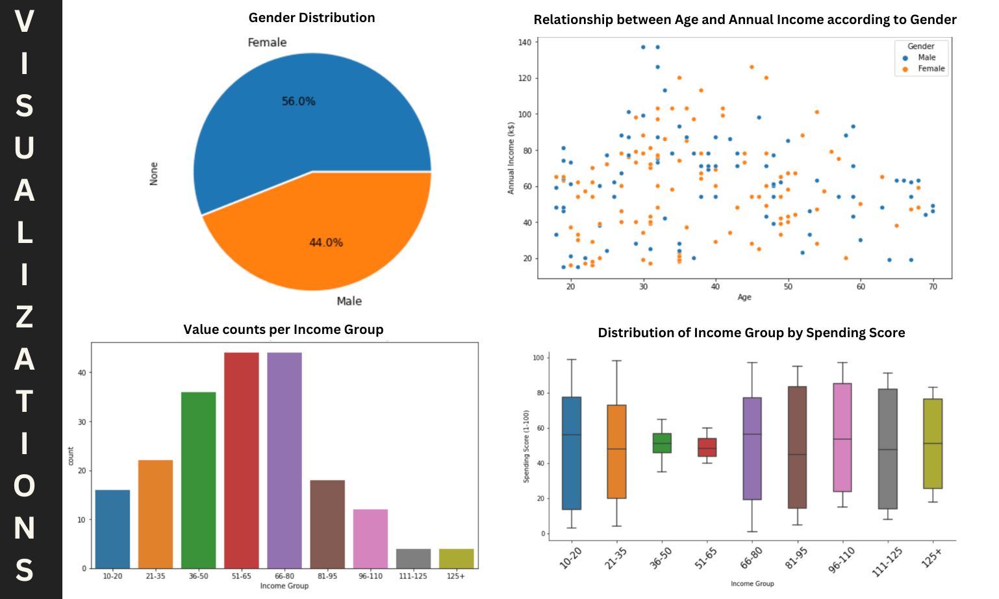
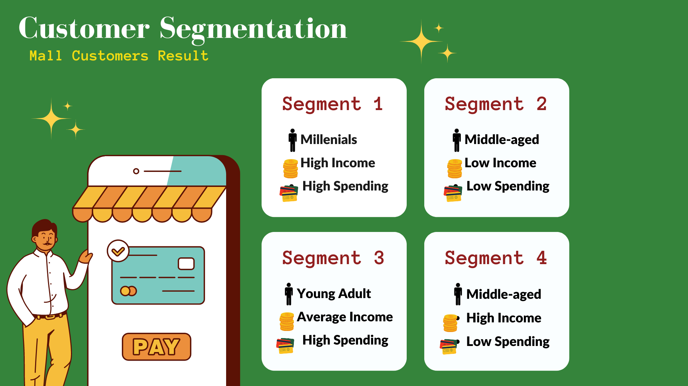

## 🏢🧑‍🤝‍🧑 MALL CUSTOMER SEGMENTATION

### 🌻 Goal:
The main goals of a customer segmentation project are to divide a large customer base into smaller, targeted groups with similar characteristics and needs. This helps businesses identify high-value customers and develop effective marketing campaigns to improve engagement and retention.

### 🌻 Data Information:
#### ▪️ Column names with corresponding descriptions:
- **Customer ID** - Customer's unique ID.
- **Gender** - Customer's gender.
- **Age** - Customer's age.
- **Annual Income (k$)** - Customer's annual income in thousands.
- **Spending Score (1-100)** - Scores ranging from 1-100 which was given based on customer behavior and spending habits by the mall.

#### ▪️ Sample data

### 🌻 Data Visualization:

### 🌻 Data Processing Steps:
- **Standardizing Data**
- **Principal Component Analysis**
- **KMeans Clustering**
- **Visualizing the Clusters**

### 🌻 Interpretations

### 🌻 Conclusion:
Good news, the data shows that there isn't much difference in spending patterns between men and women, so we don't need to focus on gender-based marketing. To increase profits, it's a good idea to target younger customers with special campaigns and to focus on high-income customers by improving service and quality. Although the average-income customers spend moderately, attracting more of them through campaigns can still benefit the store's profits. With ongoing data analysis and smart decision-making, the store can stay competitive and meet the needs of their customers.

